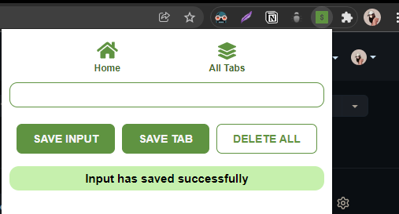

#  Tabsaver chrome extension

version 1.1

 

## How to install the extension?
--- 
1) Download & extract the zip folder

 

2) Go to extensions in the chrome browser & click on "Manage extensions"

 

3) Switch on the "Developer mode" & click on "Load unpacked"

 

4) Select the extension directory where you extracted the zip folder

 

5) Now you have successfully installed the Tabsaver extension

 

6) You can click on the "Extensions" button from any other tab & use the Tabsaver extension to save the tab URLs in your local storage

 

## How to use the extension?
--- 
- You can manually enter any URL in the input field & click on the "SAVE INPUT" button

 

- Go to the "All Tabs" section to see the list of all saved tabs
- Click on any URL in the list to open that in a new tab

 

- Click on the "SAVE TAB" button to save the current active tab

 