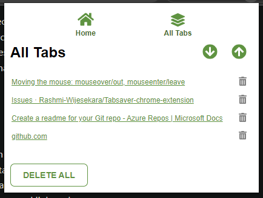

#  v1.1.0

  
   
  

  version 1.1.0

 

## How to use the extension?

- You can manually enter any URL in the input field & click on the "SAVE INPUT" button

- Click on the "SAVE TAB" button to save the currently active tab

 

- Go to the "All Tabs" section to see the list of all saved tabs

- Click on any URL in the list to open that in a new tab

- You can use the up & down arrows to change the order of the list of saved tabs

- You can click on a trash bin icon in front of any saved tab to delete that particular item from the list

- Double click on the "DELETE ALL" button to delete all the saved tabs 

 

 
